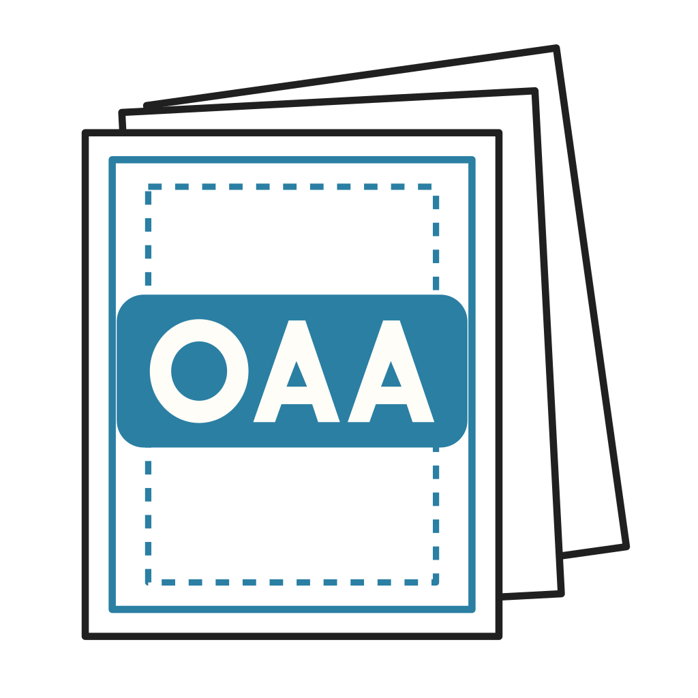

<!-- SPDX-License-Identifier: CC-BY-4.0 -->

<p align="center">
  
</p>

# Original Art Archive Validator 1.0.0

[](https://pypi.org/project/oaa-validator/)

Reference validator for the Original Art Archive (OAA) Format, manifest version
`"1.0"`. It checks archive content and bounded processing; it does not certify
another application's conformance, privacy, extraction, or preservation behavior.

The authoritative specification is maintained in
[Original-Art-Archive/oaa-spec](https://github.com/Original-Art-Archive/oaa-spec).
This repository contains the validator, local schema copies, requirement catalogs,
and test fixtures. The tests and source distribution run independently; format
decisions and guidance belong in the specification repository.

## Install and run

Requires Python 3.12 or later. Install the 1.0.0 release:

```powershell
python -m pip install oaa-validator==1.0.0
oaa-validator validate path\to\archive.oaa
oaa-validator validate-dir path\to\collection --json
```

The `oaa-validate` alias and `python -m oaa_validator` expose the same commands.
No source checkout or network schema lookup is needed after installation.

For a source checkout or unpacked source distribution:

```powershell
python -m pip install -r requirements/dev-requirements.txt
python -m pip install -e .
python -m unittest discover -s tests -p "test_*.py"
python requirements/generate_traceability.py --check
```

## Results and scope

JSON reports include `valid`, `status`, `complete`, issue severities, and requirement
IDs. Statuses distinguish `valid`, `invalid`, `unsupported`, `capacity_exceeded`,
and `io_error`. Exit codes are 0 for success, 1 for invalid input or promoted
warnings, 2 for CLI usage errors, and 3 for unsupported/incomplete processing
without proven invalidity. Read the [full usage, limits, and result semantics](validator/README.md).

Version `"0.1"` is unsupported by this release, not intrinsically invalid. Use the
historical `v0.1.2` release for the earlier implementation. The tool does not
extract files, render media, fetch URLs, publish content, or migrate collections.
Treat diagnostics as potentially private local output.

See the [validator changelog](CHANGELOG.md),
[1.0 specification](https://github.com/Original-Art-Archive/oaa-spec/blob/v1.0.0/SPEC.md),
[migration guidance](https://github.com/Original-Art-Archive/oaa-spec/blob/v1.0.0/docs/migration-0.1-to-1.0.md),
[traceability](requirements/traceability.md), and [license/marks policy](LICENSE.md).

## Verification

Release preparation passed 50 repository tests, requirements traceability,
four packaged example archives, isolated installed-wheel checks, and the same
suite from the unpacked source distribution without Git. The suite covers
bounded archive processing, the 65,537-byte Deflate trailing-garbage regression,
legacy BZIP2 version dispatch, and standalone package/schema loading.

The catalog tracks 117 requirements, including 89 with automated rule and
expected-finding coverage; fixtures define five valid cases and 77 mutations.
Tests check source-byte preservation, reject extraction/network/process-launch
calls in the privacy check, and check that private marker values stay out of
diagnostics. Diagnostics can still contain private data.

These checks used Windows and Python 3.12. They do not establish macOS/Linux
verification, independent interoperability, or another application's conformance,
extraction safety, privacy controls, or lossless preservation.

## Maintainer publishing

The existing GitHub release workflow builds and checks distributions before
publishing through the `pypi` environment and PyPI Trusted Publishing.
A manual workflow run tests/builds only; publishing requires a stable GitHub
release whose tag matches the package version. No API token is stored here.
